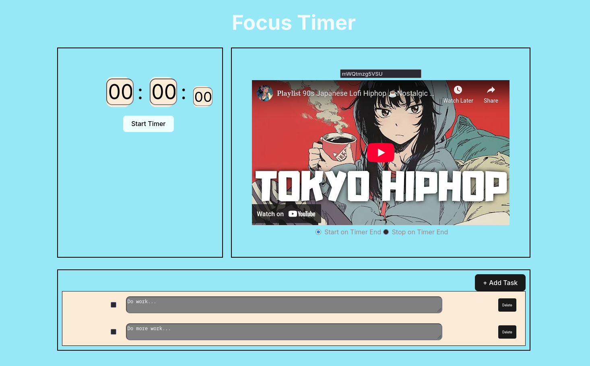

# Timer Web App
A lightweight and responsive timer web application built to help users manage time efficiently. Ideal for work sessions, workouts, or daily routines.

## Demo


## Features
- Start, pause and reset timer
- Select YouTube video ID or alarm sound
- Keep ToDo list on screen
- Play sound on completion of timer OR stop playing on timer completion

## Tech Stack
- Svelte
- Typescript
- HTML
- CSS

## Installation
### With NPM
```bash
npm install
npm run build
npm run serve
```

### With script
```bash
bash run_container.sh
```
Where run_container.sh takes the following positional arguments:
- Container service to use. E.g. "docker" or "podman". Defaults to "podman".
- Port to use. Defaults to 80.
- Name to use for container. Defaults to timer-app.

## Usage
- Create some tasks
- Set a timer
- Start crossing off ToDos!

## Deployment
A version of the app is deployed via the European Cloud Provider ExoScale here:
http://194.182.171.235/.

## Motivation
I often use [Timer Tab](https://www.timer-tab.com/) for my work sessions, but I thought to myself, it should be easy enough to build a simple version of that, ad-free, for myself, so I did.
This was also a great opportunity to learn a bit more about [Svelte](https://svelte.dev/).

## License
Licensed under the MIT License. See [LICENCE](./LICENSE) for details.
